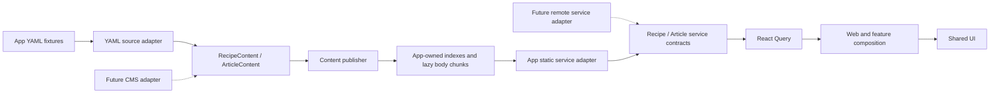

# Architectural review and layered hardening

Reviewed 2026-09-11/12. This review covers source architecture, content generation,
package ownership, dependency advisories, local serving, and deployment tooling.
The application is prerendered: production deployment uploads static files to
Cloudflare Pages, not the Nitro build server. Build-time exposure is therefore
reported separately from public runtime exposure.

## Architecture retained

All 19 layered packages remain. App adapters now have their own package manifest
and composite TypeScript project; they are not a new layer. Models, domain logic,
service contracts, React Query, content models, UI components, feature composition,
and the web entrypoint retain their existing responsibilities.

The CMS branches are integration seams, not an implemented Payload integration.
A build-time CMS adapter can supply normalized content models to `buildContent`.
A remote transport can implement the existing recipe/article services. Provider
records and rich-text formats must be mapped and sanitized by that adapter;
neither route components nor query hooks should learn a provider-specific schema.

## Findings and remediation

| Priority / classification | Evidence and exposure before this change | Resolution |
| --- | --- | --- |
| High — verified build-time code execution | `yaml.load` used the full js-yaml 3 schema. A harmless fixture with a `!!js/function` `toString` returned a marker during search-text normalization, proving invocation. Deployment builds inherit the deployment environment. | YAML uses `safeLoad`, rejects non-mapping documents, and has executable-tag regression coverage for recipes and articles. The dependency patch is separate from this API misuse fix. |
| High — build output integrity | Both parsers accepted `../../../outside`; joining that slug produced a path outside the body directory. Duplicate identities silently overwrote files. Article slug `index` collided with `articles/index.json`. | Validate lowercase kebab-case identities, per-collection uniqueness, and the reserved article index name in both the adapter and publisher. Local asset paths reject traversal and symlink escapes. |
| High / moderate — dependency advisories | The initial registry audit reported nine affected entries (four high, five moderate), through js-yaml, Nx and shadcn tooling. This is not evidence that their server vulnerabilities were exposed by the static production site. | Update affected versions using narrowly scoped overrides and recheck the entire lockfile. Add `pnpm run test:security`. |
| Medium — architectural enforcement | Thirteen package manifests omitted imported workspace dependencies. The prior guard skipped app source, unresolved workspace imports, import types, and fixture globs; it did not compare directory layer to metadata. | Complete runtime/development dependencies and TS references. Check 19 packages plus the app owner, package exports, layer metadata, app boundaries, literal dynamic imports, import types, JSDoc imports and globs. Nonliteral module imports fail closed. |
| Medium — content portability and failure handling | The shared builder climbed to the repo root, selected fixture directories, parsed YAML, hashed assets and deleted previous output before all assets were checked. | Separate YAML loading, normalization, Markdown rendering, asset processing and publication within l4. Root orchestration passes absolute paths and models. Prepare all bytes, write a staging directory, then replace output with rollback on a failed rename. |
| Medium — local preview reliability | A request for `/%zz` caused an uncaught `URIError` and exited the loopback server. Two copies of that server existed. | One root-owned server returns 400 for malformed paths, rejects startup errors, enforces filesystem containment, supports HEAD, and serves themed 404s with no-store. Web tests use an explicit test-only support entrypoint. |
| Engineering — duplicated mechanics | Static recipe/article body loading and Vite/Storybook app wiring repeated logic. Storybook did not explicitly configure the article alias. | Share internal static loading helpers and one build-only app alias/public-config factory. Public recipe/article service and query contracts remain unchanged; all four selected-app aliases are configured consistently. |
| Hardening — deployment reproducibility and browser policy | Deployment invoked an unpinned `npx wrangler`; generated headers had no framing restriction. | Pin Wrangler 4.131.1 and invoke `pnpm exec wrangler`. Add SAMEORIGIN framing and CSP `frame-ancestors 'self'; object-src 'none'; base-uri 'self'`, retaining cache rules and permitting existing scripts and embeds. |
| Engineering — source-check coverage | Completing workspace manifests revealed that the class guard descended into package `node_modules`. It also omitted app-owned components. | Exclude dependency/generated output directories and include app source. Add regression fixtures for both cases. |

### Dependency changes

The affected resolutions were js-yaml 3.15.1 and 4.3.1, brace-expansion 5.0.8,
qs 6.15.3, hono 4.13.3, and smol-toml 1.6.1. Their patched resolutions are
3.15.2 / 4.3.2, 5.0.9, 6.16.0, 4.13.5, and 1.7.1 respectively. Overrides apply
only to affected version ranges. Test-only dependencies are declared separately
from runtime dependencies. Wrangler is an exact dev dependency in the lockfile.

Upstream references: [js-yaml safe loading](https://github.com/nodeca/js-yaml/tree/3.15.1#safeload-string--options-),
[js-yaml merge limits](https://github.com/advisories/GHSA-2883-xcg3-v3hh),
[brace-expansion](https://github.com/advisories/GHSA-rgw5-rvv9-x895),
[smol-toml](https://github.com/advisories/GHSA-7w5x-hrqm-74c2),
[Cloudflare header configuration](https://developers.cloudflare.com/pages/configuration/headers/).

## Verification

- Baseline: 38 unit tests, TypeScript and the old boundary checker passed despite the verified defects.
- Content compatibility: all 22 generated JSON files (15 recipes, five articles, and two indexes) were byte-for-byte identical after the content refactor.
- New regression coverage includes non-YAML typed content models, executable YAML, slug collisions/traversal, invalid entities, missing/escaping assets, retention of previous output, package/app boundary failures, service response and lazy-loading behavior, public-config filtering, and preview-server recovery.
- Registry audit after patching: zero reported vulnerabilities across all severity levels.
- `pnpm test`: passed, including 86 static-build assertions, 212 SEO assertions, 37 interaction assertions, 134 recipe-page assertions, and 90 Storybook stories at two widths (180 checks, zero failures).
- Final `pnpm run test:unit`: 53 tests passed. The class-guard regression suite also passes after excluding dependency directories and test-only prose and including app source.
- `pnpm run boundaries` and `pnpm run typecheck:ts`: passed with the explicit app project and content-model references.
- `pnpm run test:a11y`: 39 page/state checks at 1366, 390 and 320 pixels; zero failures across all configured WCAG impact levels.
- `pnpm run test:lighthouse`: all six representative pages scored 100 for accessibility and 100 for SEO. Performance was not a configured category in this suite.
- Pinned Wrangler reports version 4.131.1; no deployment command was executed.

### Accessibility report review

Both generated axe reports were inspected, including their incomplete entries.
Storybook recorded 90 `bypass`, 14 `color-contrast`, 40 `aria-hidden-focus`, and
two `aria-required-children` incomplete entries. The bypass entries concern the
isolated story document; required-children entries concern the empty search
palette. The app report recorded 12 `aria-hidden-focus` and 14 `color-contrast`
incomplete entries. These are not counted as passed accessibility rules.

The reported focus nodes are Radix focus guards and background content hidden
while a modal is open. Existing browser interaction and Storybook play tests
exercise palette focus, keyboard selection, closing and workbench interaction.
Contrast entries include non-text arrows, logos, image/overlapping backgrounds,
and content partially obscured within the scrolled drawer. No UI styles were
changed to silence these reports. Manual accessibility assessment remains
necessary for those cases; this review does not claim complete WCAG conformance.

## Limits and operational notes

No production deployment or Cloudflare account configuration change was performed.
Generated response headers are verified locally; production enforcement must be
checked through the existing post-deployment verification workflow when released.
The conservative CSP is not a strict script allowlist. Provider adapters remain
responsible for sanitizing rich text before supplying HTML content models.

Output publication preserves old content on validation, asset, serialization and
handled publication failures. It is a local build operation, not a concurrent
content database: it does not promise uninterrupted availability across process
termination between directory renames. Failed rollback retains its backup for
recovery. Run one content publisher per app output directory.

No layers, service interfaces, React Query APIs, routes, workbench state formats,
or UI styling were redesigned. Checks remain local; no GitHub Actions were added.
The working tree was clean when implementation began, and the previously active
workbench changes were not edited by this refactor.
